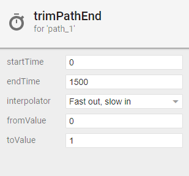
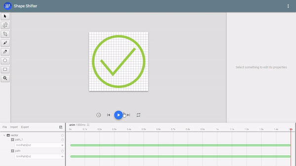
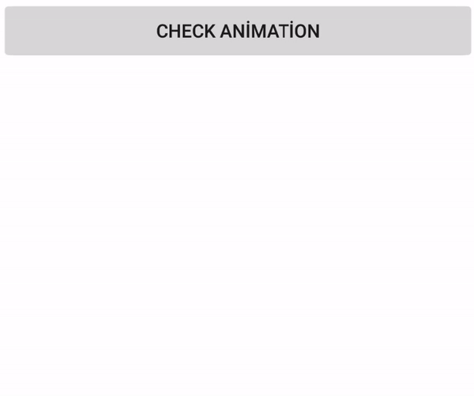

# AnimatedVectorDrawableExample
Android Animation Example with Animated Vector Drawable and SVG File

If you want to add several animations in your android app, you can use Animated Vector Drawable. There are some advantages in comprassion
with old properties. ShapeShifter is a tool that makes easier to create icon animaton from SVG file to Animated Vector Drawable file.
Let's say, you make check icon with circle more impressive. Firstly, you find the icon or you can create own icon in ShapeShifter's beta
version. In this example, we have 2 paths.

TIPS: If your icon you want to animated is seperated and not connect to each other, you must use path as much as your seperated pieces
number. Otherwise your pieces try to connect and undesirable lines are appeared.

One of them is outer circle and get it's path;
```
M 1.661 12 C 1.661 6.319 6.29 1.714 12.001 1.714 C 17.709 1.714 22.34 6.319 22.34 12 C 22.34 17.681 17.709 22.286 12.001 22.286 C 6.29 22.286 1.661 17.681 1.661 12 Z
```
One of them is inner check and get it's path;
```
M 4.821 11.456 L 9.643 17.25 L 18.643 6.643
```

So we created 2 path in same vector, because we have 2 seperated pieces. Then we add trimPathEnd animation that duration is 1500 ms and
fromValue 0 to toValue 1 both of them.



As a result, our animation is look like;



Then we export it as Animated Vector Drawable and we have an xml file now. We put it in the /res/drawable folder and called it
check_icon_animation.xml

Now, we add a click action to button and our animated is triggered when we click this button.

```java
Button btn_check;
ImageView iv_animation;

@Override
protected void onCreate(Bundle savedInstanceState) {
  super.onCreate(savedInstanceState);
  setContentView(R.layout.activity_main);

  btn_check = (Button) findViewById(R.id.btn_check);
  iv_animation = (ImageView) findViewById(R.id.iv_animation);

  btn_check.setOnClickListener(new View.OnClickListener() {
    
    @Override
    public void onClick(View view) {
      iv_animation.setImageResource(R.drawable.check_icon_animation); //set animation xml to imageview as resource
      iv_animation.setVisibility(View.VISIBLE); //make it visible
      ((Animatable) iv_animation.getDrawable()).start(); //start animation
    }
  });
}
```

Result;


